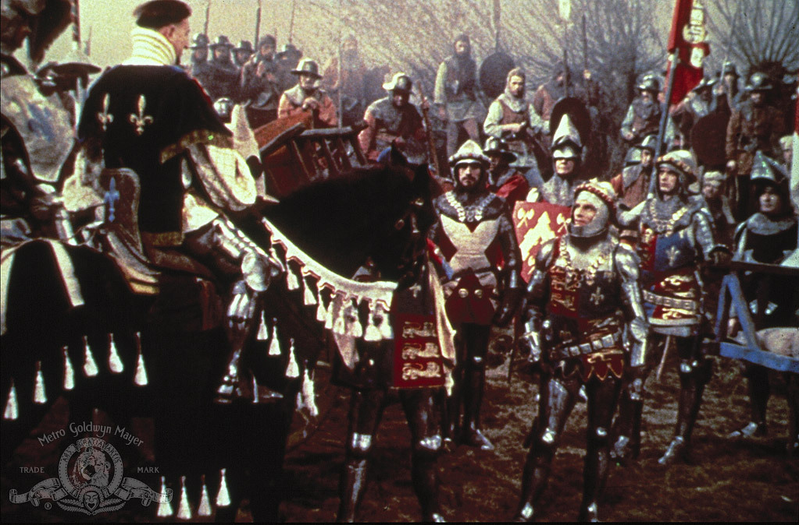

# Henry V by W.S.

> *Your highness, lately sending into France, did claim some certain dukedoms, in the right of your great predecessor, King Edward the Third. In answer of which claim, the prince our master says that **you savor too much of your youth**. And bids you be advised: there's nought in Franch that can be with a nimble galliard won; You cannot revel into dukedoms there. He therefore sends you, **meeter for your spirit**, this tun of treasure; and, in lieu of this, desires you let the dukedoms that you claim hear no more of you. **This the Dauphin speaks.***

In the 1944 film by Olivier the French are portrayed in a comedic representation of the general state of France and the throne at the time. The French fatally underestimated Henry, owing both to King Charles' inability to rule and the presumptuous and spoiled Dauphin.
